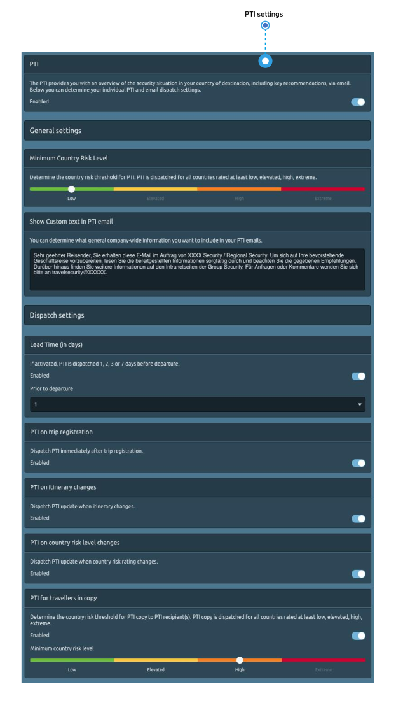

# Pre-Trip Information

## Wie kann ich die Länderinformationen, die meine Reisenden vor Reiseantritt erhalten, weiterverfolgen?

Die Pre-Trip Information \(PTI\) bietet einen Überblick über die Sicherheitslage in einem Reisezielland, einschließlich grundlegender Empfehlungen. Genauer gesagt gibt es für jedes Land, das der Reisende während einer Reise besucht, einschließlich der Abreise- und Transitländer \(wenn gewünscht\), eine PTI. 

**Die PTI wird vor der Abreise per E-Mail zugestellt**. Je nach den Bedürfnissen Ihres Unternehmens können Sie die folgenden PTI- und E-Mail-Versandeinstellungen festlegen.

### SCHLÜSSELFUNKTIONEN UND EINSTELLUNGEN

* Die **PTI wird an die registrierte E-Mail-Adresse von Reisenden gesendet**, außer Sie deaktivieren sie.
* Sie können den **Begrüßungstext von PTI-E-Mails**, die an Ihre Reisenden gesendet werden, so **individuell gestalten**, dass diese sie als vertrauenswürdige Nachricht ihres Arbeitgebers/Unternehmens erkennen können. Zum Beispiel: Diese E-Mail wird im Namen IHRES UNTERNEHMENS versandt. Bitte lesen Sie die folgenden Informationen über Ihr Zielland sorgfältig durch.... Gute Reise.
* **Bestimmen Sie die Länderrisikoschwelle für die PTI**. Die PTI wird für alle Länder versandt, die mindestens mit einem geringen, erhöhten, hohen, extremen Risiko bewertet sind. Auf diese Weise können Sie z.B. PTI für risikoarme Zielländer ausschließen.
* **Bestimmen Sie den Länderrisikoschwellenwert für Report Empfänger**. Der PTI wird für alle Länder versandt, die mindestens als niedrig, erhöht, hoch oder extrem eingestuft werden. Sie können eine Kopie aller PTIs für Reisende erhalten. Auf diese Weise sind Sie nicht nur über alle Reisen, z.B. in Hochrisikoländer, informiert, sondern haben auch den Nachweis, dass Sie Ihre Fürsorgepflicht erfüllt haben.
* **Erhalten Sie die PTI sofort nach der Reiseanmeldung**: Dies ist eine hilfreiche Funktion für Reisende, die sicher sein wollen, dass ihre Reiseanmeldung erfolgreich war.
* **Vorlaufzeit: Sie können wählen, ob Sie die PTI 1, 2, 3 oder 7 Tage vor der Abreise versenden** **möchten**. Entsprechend Ihrer Unternehmensvorgaben können Sie festlegen, wie viele Tage vor der Abreise Ihre Reisenden die Informationen erhalten und somit genügend Zeit haben, sich entsprechend vorzubereiten. Wenn gemäß Ihrer obigen Einstellung unmittelbar nach der Reiseanmeldung eine PTI gesendet wird, kann diese eine zusätzliche Erinnerung sein.
* **PTI bei Änderungen des Reiseverlaufs versenden**: Reisebuchungen können manchmal komplex sein, insbesondere wenn ein bestehender PNR Datensatz geändert wird. Es können Daten, Zeiten, Fluggesellschaften oder Reiseziele und Zwischenstopps, etc. geändert und hinzugefügt werden. Wählen Sie diese Funktion, um sicherzustellen, dass Ihre Reisenden im Falle von Änderungen der Reisebuchung umfassend durch die PTI informiert werden.
* **PTI bei Änderung des Länderrisikos versenden**: Die Reisevorschriften Ihres Unternehmens können je nach Risikoeinstufung unterschiedliche Prozesse für die Zielländer vorsehen. Mit dieser Funktion erhalten Reisende aktualisierte Informationen wenn sich die Risikostufe des Landes ändert. So können Sicherheitsmaßnahmen bei Bedarf angepasst werden.
* **Ignorieren Sie die Abflughäfen:** Wenn diese Einstellung aktiviert ist, erfolgt für den Ort des Abflughafens kein PTI-Versand. Eine PTI wird nur für Zielländer gesendet.
* **PTI für das Land der Beschäftigung ausschließen**: Wenn diese Einstellung aktiviert ist, erhalten Reisende keine PTI für Aufenthalte und Reisen in dem Land, in dem sie beschäftigt sind. Bitte beachten Sie, dass Nutzer ihr persönliches Beschäftigungsland im Nutzerprofil festlegen können, durch welches das unternehmensweit geltende Land ersetzt wird. Bitte wenden Sie sich an Ihren Kundenbetreuer, wenn Sie diese Einstellung nutzen möchten. **Als Beispiel**: Ein in Deutschland ansässiges Unternehmen möchte wahrscheinlich PTIs für Deutschland generell ausschließen. Ein Mitarbeiter desselben in Deutschland ansässigen Unternehmens kann in Frankreich arbeiten. Er kann den Erhalt von PTIs für Frankreich ausschließen, indem er sein Nutzerprofil entsprechend einrichtet. 
* **Mindestaufenthaltsdauer:** Sie können festlegen, dass für kurze Aufenthalte \(z.B. Transit\) keine PTI an den Reisenden geschickt werden soll. Wenn diese Einstellung aktiviert ist, lösen Aufenthalte, die kürzer als 1, 2, 4 oder 8 Stunden sind, keinen PTI-Versand aus.

