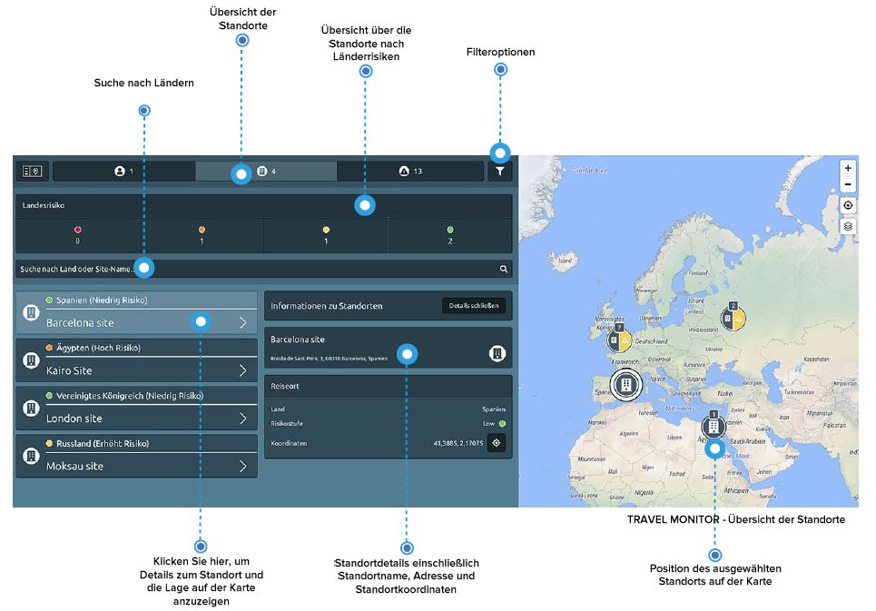

# Standorte

Wie erhalten Sie einen Überblick über Ihre Standorte? Klicken Sie auf den Button Standorte im Menü des Travel Monitors, um eine Liste der Standorte und Niederlassungen Ihres Unternehmens zu erhalten, falls Sie diese integriert haben. Verwenden Sie die Suchleiste, um einen bestimmten Standort zu finden. Sie können nach dem Namen eines Standortes oder nach Land/Ländern suchen, um mehrere Standorte in diesen Ländern anzeigen zu lassen. 

Klicken Sie auf ein Standortsymbol auf der Karte oder auf einen Standort in der Liste, um die verfügbaren Details anzuzeigen: die Standortadresse und die genauen Standortkoordinaten.

