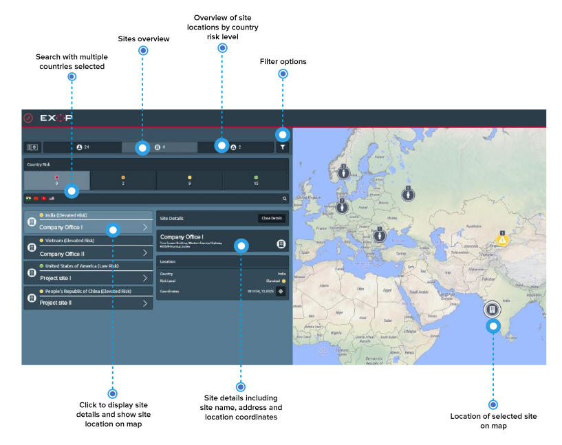

# Sites

Click the sites button in the travel monitor menu to display a list of the sites and office locations of your company, if you integrated them. Use the search bar to find a specific site. You can search for the name of a site or search by country/ countries to display multiple sites located in those countries. 

Click on a site icon on the map or on a site in the list to display the details available: the site address and the exact site location coordinates.

