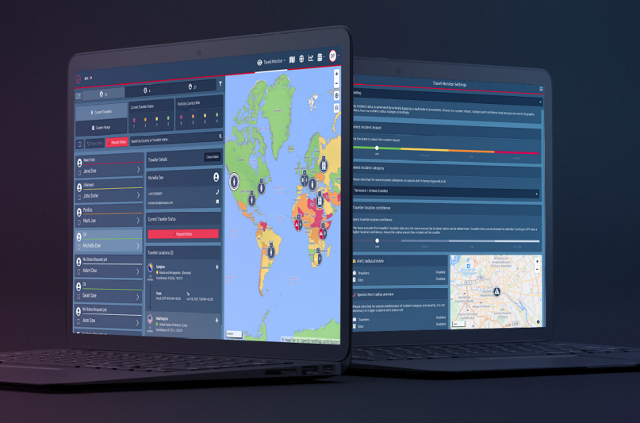
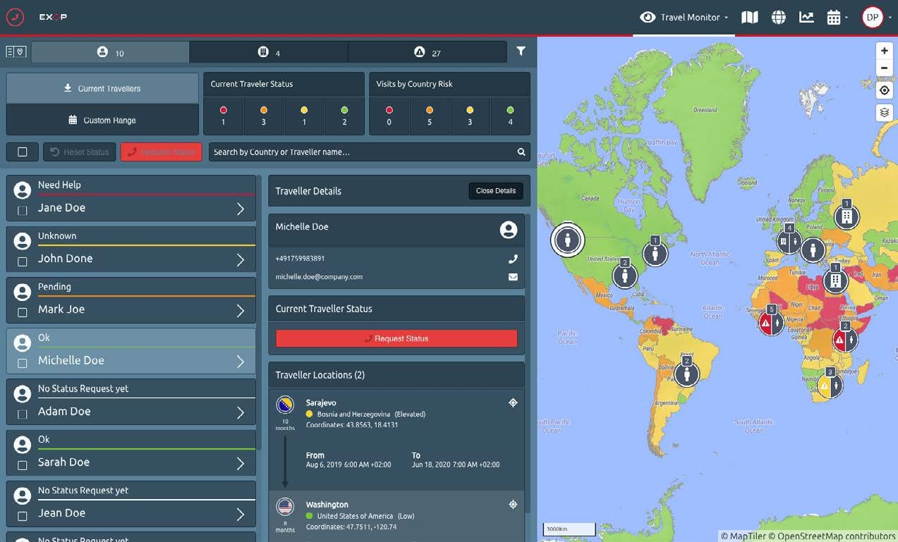

# Travel Monitor

The **Travel Monitor** is the heart of the platform. Travel managers can monitor and overview travellers and their statuses worldwide, trace emergencies and initiate status calls. According to your settings, the Travel Monitor steers and defines alerting, communication and emergency procedures for your company.

### How the Travel Monitor looks like?

Setting up the platform takes around 10 minutes, once you have defined all your settings, you will have the system do the job for you. 

Take your time to define your company settings in the sections: 

* Assistance
* Pre-trip information
* Alerting


 Please note that we have prepared a set of default settings to make your start easier.


### What do I see and how do I operate it?

* Your company’s valuables – **travellers** and **sites** as well as **alerts** and all the relevant information details on them can be overviewed in the travel monitor. 
* The default view for desktop use is the 1:1 view, sharing the screen between **the navigation panel on the left and the map on the right**. All navigation including list selection will be mirrored in the map and vice-versa. If you select an item in the list, you will not only see the object details in the panel but also the object’s location on the map. 
* You can also navigate through the map, zoom in for a more detailed map view and choose between multiple risk and **information layers** using the layer navigation in the upper-right corner of the map. If you find the map too crowded, you can de-select, for example, sites and alerts to reduce the information and number of icons on the map.

